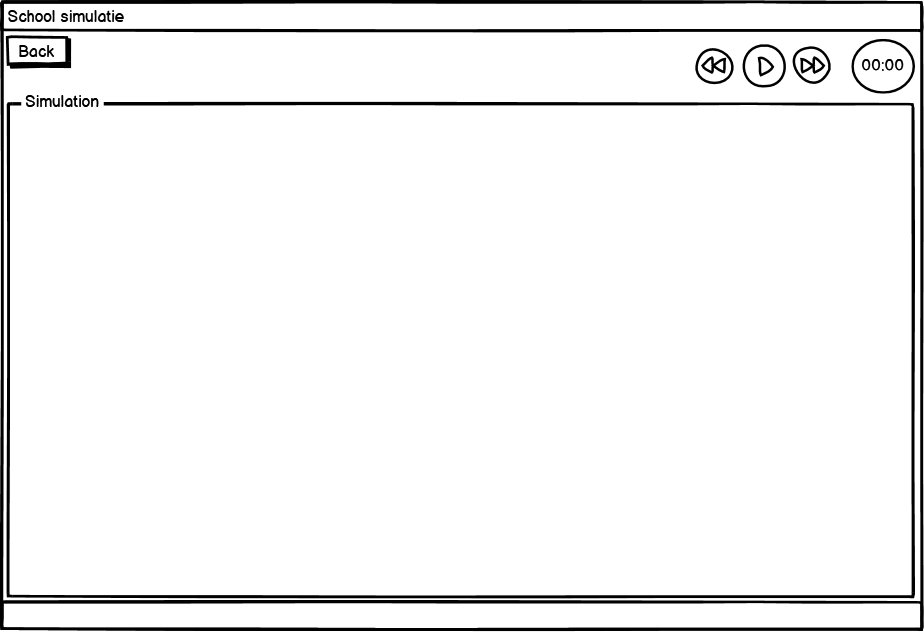

# Markdown Sebastiaan Tromper
## Wekelijkse reflectie
### Week 2
#### Wat heb je gedaan?
In deze week heb ik de lay-out gemaakt in balsamiq voor de agenda module.




#### Beslissingen
- Lessen worden door één leraar gegeven.
	- Dit is normaal voor een gebruikelijke les en voor de simpelheid.
- Één groep per les.
	- Dit is normaal voor een gebruikelijke les.
- Één les vindt plaats in één lokaal
	- Dit is normaal voor een gebruikelijke les.
- Er zijn maximaal 12 leerlingen per klas.
	- I.v.m. overzichtelijkheid.
- Er zijn 6 groepen studenten.
	- I.v.m. overzichtelijkheid.
- Er zijn 6 leslokalen.
	- Er is voor deze hoeveelheid gekozen om het gelijk te houden aan het aantal klassen en leraren.
- De dag begint om 08:00 tot 17:00.
	- Hiervoor is gekozen om een vaste begin en eindtijd vast te stellen voor de simulatie.
- De lessen kunnen ingeroosterd worden van 8:30 tot 16:30.
	- Dit is normaal voor een schooldag.
- Er zijn maximaal 6 docenten.
	- Er is voor deze hoeveelheid gekozen om het gelijk te houden aan het aantal klassen.
- Gaan we tabs, view venster gebruiken of laten we het zo?
	- Tabs, het is dan een stuk meer overzichtelijker, simpeler en netter.
- Hoe worden groepen aangemaakt in de GUI? Zit daar een maximum aan? Een minimum?
	- Groepen worden voorgeprogrammeerd.
- Zijn de vakken vast voor geprogrameerd. Zo ja, welke vakken zijn er?
	- Ja, welke wordt nog gediscusseerd.
- Als een groep leeg is, wat gebeurt er als een leraar les geeft aan een lege groep. (Als dat gebeurt)
	- Die zijn niet leeg.
- Wat gebeurt er als alle groepen vol zijn en 'Generate Random' wordt gedrukt?
	- Dan wordt er een fout melding gegeven.
	
### Week 3
#### Wat heb je gedaan?
In deze week heb ik de tilemap gemaakt voor de simulatie:


Tevens heb ik gekeken naar de mogelijk om de lijst student, leraar en rooster op te slaan. De mogelijkheid waar ik naar gekeken heb is fileIO. Het is gelukt om de gegevens op te slaan in een fileIO bestand, maar niet om de informatie eruit te halen.

Code voor opslaan:
``` Java code
try {
            File teacherAdd = new File("Student.txt");
            FileWriter teacherAddFr = new FileWriter(teacherAdd, true);
            BufferedWriter teacherAddBr = new BufferedWriter(teacherAddFr);
            teacherAddBr.write(studentNameField.getText() + "," + StudentGender + "," + StudentGroup + "\n");

            teacherAddBr.close();
            teacherAddFr.close();
        }catch (IOException e){

        }
```

Code voor veranderingen opslaan:
``` Java code
 try {
            File inputFile = new File("Teacher.txt");
            File tempFile = new File("TeacherTemp.txt");

            BufferedReader reader = new BufferedReader(new FileReader(inputFile));
            BufferedWriter writer = new BufferedWriter(new FileWriter(tempFile));

            for (int i = 0; i < teachersTable.getItems().size(); i++){
                writer.write(teachersTable.getItems().get(i).toString());
            }

            writer.close();
            reader.close();

            inputFile.delete();
            tempFile.renameTo(new File("Teacher.txt"));
        }catch (IOException e) {

        }
}
```

### Week 4
#### Wat heb je gedaan?
In deze week heb ik onderzoek gedaan naar JSON en geëxperimenteerd met wat we hebben.
Ik heb uiteindelijk voor elkaar gekregen om de JSON file uit te lezen.

  ``` Java code
  public class Map {
	private int width;
	private int height;

	private int tileHeight;
	private int tileWidth;

	private ArrayList<BufferedImage> tiles = new ArrayList<>();

	private int[][] map;

	public Map(String fileName)
	{
		JsonReader reader = null;
		reader = Json.createReader(getClass().getResourceAsStream(fileName));
		JsonObject root = reader.readObject();

		this.width = root.getInt("width");
		this.height = root.getInt("height");

		//load the tilemap
		try {
			BufferedImage tilemap = ImageIO.read(getClass().getResourceAsStream(root.getJsonArray("tilesets").getJsonObject(0).getString("image")));

			tileHeight= root.getJsonArray("tilesets").getJsonObject(0).getInt("tileheight");
			tileWidth= root.getJsonArray("tilesets").getJsonObject(0).getInt("tilewidth");

			for(int y = 0; y < tilemap.getHeight(); y += tileHeight)
			{
				for(int x = 0; x < tilemap.getWidth(); x += tileWidth)
				{
					tiles.add(tilemap.getSubimage(x, y, tileWidth, tileHeight));
				}
			}
		} catch (IOException e) {
			e.printStackTrace();
		}

		map = new int[height][width];
		for(int y = 0; y < height; y++)
		{
			for(int x = 0; x < width; x++)
			{
				map[y][x] = root.getJsonArray("layers").getJsonObject(0).getJsonArray("data").getInt(x);
			}
		}
	}
  ```
### Week 5
#### Wat heb je gedaan?
In deze week heb ik de animaties gemaakt voor de teachers en students voor naar links, rechts, boven en beneden.
Dit richting is gebaseerd op de angle van waar ze naar toe moeten lopen.

Code voor inladen sprites:
Hier wordt de png file feitelijk in stukjes gehad en onderverdeeld in subimages.
``` Java code
	if (this.genderTBST.get().equals("Female")) {
                image = ImageIO.read(getClass().getResource("/Female.png"));
            } else {
                image = ImageIO.read(getClass().getResource("/Male.png"));
            }

        tiles = new BufferedImage[35];
        for (int i = 0; i < 35; i++) {
            tiles[i] = image.getSubimage(64 * (i % 9), 64 * (i / 9), 64, 64);
        }

        up = new BufferedImage[9];
        for (int i = 1; i < 9; i++) {
            up[i - 1] = image.getSubimage(64 * (i % 9), 64 * (i / 9), 64, 64);
        }

        left = new BufferedImage[9];
        for (int i = 10; i < 18; i++) {
            left[i - 10] = image.getSubimage(64 * (i % 9), 64 * (i / 9), 64, 64);
        }

        down = new BufferedImage[9];
        for (int i = 19; i < 27; i++) {
            down[i - 19] = image.getSubimage(64 * (i % 9), 64 * (i / 9), 64, 64);
        }

        right = new BufferedImage[9];
        for (int i = 28; i < 36; i++) {
            right[i - 28] = image.getSubimage(64 * (i % 9), 64 * (i / 9), 64, 64);
        }
```

Code voor bepalen welke richting
Hier wordt afhankelijk van de waarde van de angle bepaald welke animatie er getekend moet worden.
``` Java code
	if (angle > 0.8 && angle < 2.2) {
            walkingRight = false;
            walkingLeft = false;
            walkingUp = false;
            walkingDown = true;
        } else if (angle > -0.8 && angle < 0.8) {
            walkingRight = true;
            walkingLeft = false;
            walkingUp = false;
            walkingDown = false;
        } else if (angle > -2.2 && angle < -0.8) {
            walkingRight = false;
            walkingLeft = false;
            walkingUp = true;
            walkingDown = false;
        } else if (angle > 2.2 || angle < -2.2) {
            walkingRight = false;
            walkingLeft = true;
            walkingUp = false;
            walkingDown = false;
        }
	
	public void draw(Graphics2D g) {
        if (walkingRight) {
            g.drawImage(right[(int) counter], getTransform(), null);
        } else if (walkingLeft) {
            g.drawImage(left[(int) counter], getTransform(), null);
        } else if (walkingUp) {
            g.drawImage(up[(int) counter], getTransform(), null);
        } else if (walkingDown) {
            g.drawImage(down[(int) counter], getTransform(), null);
        }
    }
```
#### Beslissingen
- Hoeveelheid layers verminderd naar 4 + target layers
	- 

### Week 7
#### Wat heb je gedaan?
In deze week heb ik samen met Bart van Moorsel de Target class gemaakt. Deze class alle "targets" aan waar de studenten en leraren naar toe moet lopen. Met deze klasse is het mogelijk om alle informatie die nodig is uit de Json file te halen. Deze waardes zijn onder andere: X-coördinaat, Y-coördinaat, hoogte, breedte en middelpunt.

``` Java code
import data.Classroom;

import javax.json.Json;
import javax.json.JsonArray;
import javax.json.JsonObject;
import javax.json.JsonReader;
import java.awt.geom.Point2D;
import java.io.FileInputStream;
import java.util.ArrayList;
import java.util.HashMap;

public class Target {

    private Classroom cantine = new Classroom("canteen");
    private Classroom teacherRoom = new Classroom("teacherroom");
    private Classroom classroom101t = new Classroom("101t");
    private Classroom classroom102t = new Classroom("102t");
    private Classroom classroom101s = new Classroom("101s");
    private Classroom classroom102s = new Classroom("102s");
    private Classroom classroom103s = new Classroom("103s");
    private Classroom classroom104s = new Classroom("104s");
    private Classroom classroom103t = new Classroom("103t");
    private Classroom classroom104t = new Classroom("104t");
    private Classroom classroom105t = new Classroom("105t");
    private Classroom classroom105s = new Classroom("105s");
    private Classroom classroom106t = new Classroom("106t");
    private Classroom classroom106s = new Classroom("106s");
    private Classroom toilets = new Classroom("toilets");

    private JsonArray layers;
    private ArrayList<String> classroomCodesList;
    private HashMap<String, Integer> hashMap;
    private ArrayList<Classroom> classroomsList;

    public Target(String filename){
        classroomCodesList = new ArrayList<>();
        hashMap = new HashMap();

        classroomsList = new ArrayList<>();

        classroomsList.add(cantine);
        classroomsList.add(teacherRoom);
        classroomsList.add(classroom101t);
        classroomsList.add(classroom102t);
        classroomsList.add(classroom101s);
        classroomsList.add(classroom102s);
        classroomsList.add(classroom103s);
        classroomsList.add(classroom104s);
        classroomsList.add(classroom103t);
        classroomsList.add(classroom104t);
        classroomsList.add(classroom105t);
        classroomsList.add(classroom105s);
        classroomsList.add(classroom106t);
        classroomsList.add(classroom106s);
        classroomsList.add(toilets);

        classroomCodesList.add(cantine.getClassNumber());
        classroomCodesList.add(teacherRoom.getClassNumber());
        classroomCodesList.add(classroom101t.getClassNumber());
        classroomCodesList.add(classroom102t.getClassNumber());
        classroomCodesList.add(classroom101s.getClassNumber());
        classroomCodesList.add(classroom102s.getClassNumber());
        classroomCodesList.add(classroom103s.getClassNumber());
        classroomCodesList.add(classroom104s.getClassNumber());
        classroomCodesList.add(classroom103t.getClassNumber());
        classroomCodesList.add(classroom104t.getClassNumber());
        classroomCodesList.add(classroom105t.getClassNumber());
        classroomCodesList.add(classroom105s.getClassNumber());
        classroomCodesList.add(classroom106t.getClassNumber());
        classroomCodesList.add(classroom106s.getClassNumber());
        classroomCodesList.add(toilets.getClassNumber());

        JsonReader reader;
        reader = Json.createReader(getClass().getResourceAsStream("/Tilemap.json"));
        JsonObject root = reader.readObject();

        layers = root.getJsonArray("layers").getJsonObject(4).getJsonArray("objects");

        for(int i = 0; i < layers.size(); i++) {
            int id = layers.getJsonObject(i).getInt("id");

            hashMap.put(classroomCodesList.get(i), id);
        }
        reader.close();
    }

    public int getX(int location){
        return layers.getJsonObject(location).getInt("x");
    }

    public int getY(int location){
        return layers.getJsonObject(location).getInt("y");
    }

    public int getHeight(int location){
        return layers.getJsonObject(location).getInt("height");
    }

    public int getWidth(int location){
        return layers.getJsonObject(location).getInt("width");
    }

    public String getName(int location) {
        return layers.getJsonObject(location).getString("name");
    }

    public Point2D getCenter(int location){
        return new Point2D.Float((float) (getX(location) + (getWidth(location) / 2.0)), getY(location) + (float) (getHeight(location) / 2.0));
    }

    public ArrayList getClassroomCodesList(){
        return classroomCodesList;
    }

    public ArrayList<Classroom> getClassroomsList(){
        return classroomsList;
    }

    public HashMap<String, Integer> getClassroomsHashMap() {
        return hashMap;
    }
}
```

## Reflectie op stelling
### In het bedrijfsleven wordt gebruik gemaakt van JavaFX
In het bedrijfsleven wordt inderdaad nog steeds gebruik gemaakt van JavaFX. 
Voorbeelden hiervan zijn:
-Trading App
-QuoteMonitor
-Deep Space Trajectory Explorer Nasa
-MINT TRMS
-Network Capacity Optimization Emirates Airline
-PSI Advanced Scheduling and Monitoring / ASM
-Navigator Lynden

Gebaseerd of deze informatie blijkt dat JavaFX nog redelijk wat gebruikt wordt in het bedrijfsleven. Voor sommige dingen wordt JavaFX gebruikt voor het maken van apps en andere wordt het gebruikt voor intern gebruik.

#### Bronvermelding
(https://www.educba.com/javafx-applications/)

## Applicaties die JSON gebruiken
- Games, Json kun je gebruiken om bijvoordbeeld informatie op the slaan voor sliders, key bindings en configurations. Dus het kan hiervoor geschikt zijn.
-Twitter, dit kan Json gebruiken om data snel en makkelijk over te sturen.
-Facebook, dit kan Json gebruiken om data snel en makkelijk over te sturen.
-Google Maps, dit kan Json gebruiken om data snel en makkelijk over te sturen.


## Notitie
(https://github.com/STavans/Markdown.git)
